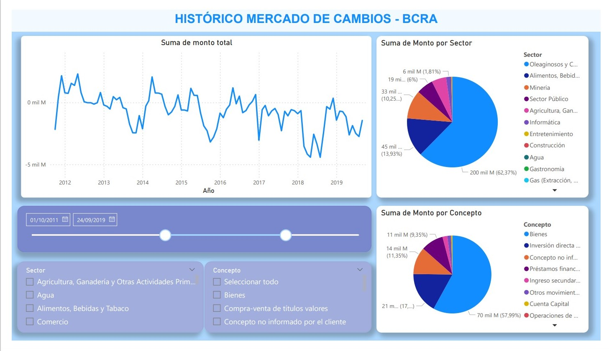

Con este sencillo dashboard se puede visualizar el monto total de ingreso/egreso de moneda extranjera (en dólares) en Argentina a lo largo del tiempo.
Se filtra por Tiempo , Sector (ej: agro, energéticas, informática, etc) y por concepto del ingreso/egreso.

La fuente de los datos: (www.bcra.gob.ar)

